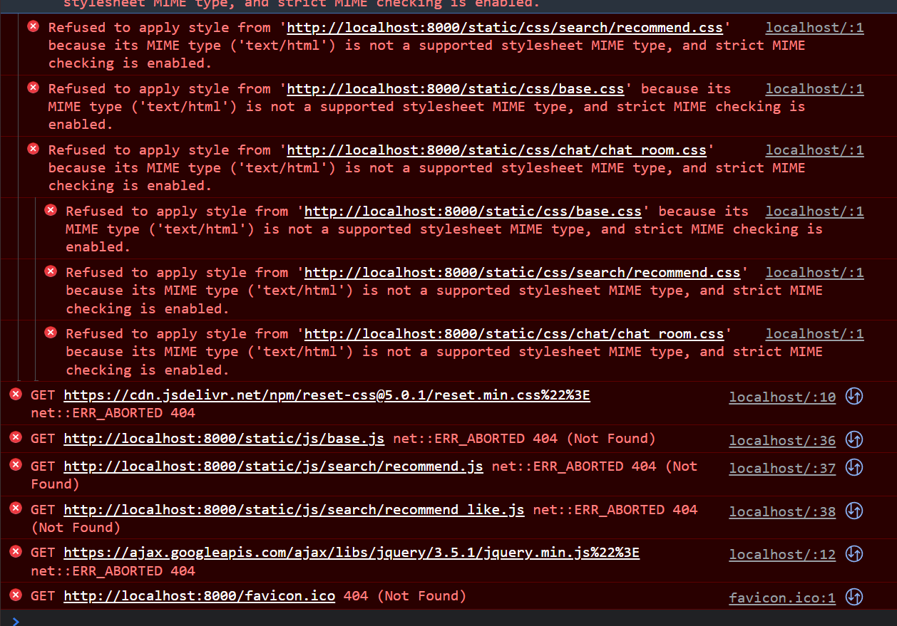

## 3월 29일

***

* ALALTalk
  * BackEnd
    * 찜 기능 / 찜 취소 기능 - Youtube, Book, News 완료 (DB 저장 및 중복 작업)
    
  * FrontEnd
    * 찜 기능 / 찜 취소 기능 Ajax 연결 및 구현 
    * 머신 러닝 서버 연결 

* Error
  > JVM library 관련 Error 
  > 
  > 머신러닝 서버에서 형태소 분석기인 `kormran` 을 사용하는데 해당 라이브러리는  
    `java`를 이용하여 만든 `python` 코드이다. 따라서 `java`를 기반으로 만들었으므로  
    `JAVA Development Kit` 이하 `JDK`를 깔아줘야한다.  
  > 추가로 `jypipe` 도 같이 깔아줘야 한다. 
  
  > * 에러 메세지
  >  
  > 
  >  해당 에러는 `HTML`에서 `<link>` 태그, `<script>` 태그 에서 지정한 파일들의  
  >  경로를 찾지 못할때 발생하는 에러이다.   
  > *  상황  
  > `Django` 에서 `AWS S3`를 통해 `static` 폴더를 전부 옮겨 놓은 후 연결까지 확인을 했지만
  >  실제 작업을 할 때는 바로 바로 적용이 되질 않는다고 하여 파일 등록한 부분만 주석처리하면 정상작동이 되는 줄 알았음
     
  > 
  > * 해결  
  > `setting.py`  에서 `DEBUG = False` 부분을 `DEBUG = True` 로 변경해 주었더니 정상 작동 했다.  
  >  이유는 `urls.py` 에서 빨간색 박스 친부분 때문으로 추측이 되는데  `DEBUG` 가 `False` 인 상황에서 작동 하는 코드 이기 때문이다.      
  >   
  >  
  > 
  > 
  
  >따라서 `DEBUG=True` 로 헀더니 정상 작동했다.

     

* 책읽기 
  * CleanCode ~49page

* 

  
__간단 소감__
>  Youtube나 지난번에 들었던 특강에서 들은 바로는 회사는 깊이 있는 개발자,   
>   꾸준하게 성장하고 있는 개발자을 뽑고 싶어하고 이러한 어필을 잘 해놓거나    
> 증거물을 잘 남겨 놓은 것이 좋은 포트폴리오라고 들었다.   
> 비록 그동안 프로젝트 때문이라고 핑계를 대며 작성하지 않았지만 다시 한번 꾸준하게 작성하고자 다시 시작했다.   
> 나는 내가 많이 귀찮아하는 걸 알고 어느순 간 또 공백이 생길테지만 다시 시작하는 건 잘할 자신이 있으니 걱정 말고 다시 시작해보자  
>  