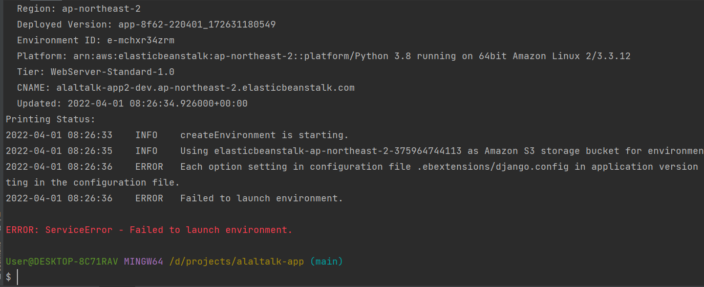

## 4월 4일

***

* Project - ALALTalk
  * `div` 수정
  * `awsCache` 생성
  * 서비스 배포
    * Elastic beanstalk 시도 - 실패
    * EC2 시도
      * `Daphne` 서버 실행
      * `nginx` 시도
      * `uWSGI` 시도

     

* Info
  * `poetry` 를 이용한 `ElasticBeanstalk` 은 가상환경을 만들기가 안된다.
  * `channels` 배포시 알아둬야하는 점
    * `Daphne` 
      * 서버 구동은 `runserver` 하는 거와 비슷하다. ( 포트 번호 꼭 붙이기)
      * `http` 요청과 `websoket` 요청을 분리하여 받아드린다. 
      * `SSL` 요청을 할 수 있다. 
    * `Daphne` 서버의 `static` 파일들 구동이 안좋기 때문에 `nginx`, `uWSGI`을 이용하여 처리하는 게 더 좋은 방법이다.
    
* Error
  * Elastic Beanstalk 배포  
    * requirements.txt error 
    
    
    
    
  * 
  * `Router53` 도메인 lock - `Github`에 `IAM` 사용자 KEY를 올리게 되면 계정이 잠금(?)처리가 된다.
  
  
  
  

__간단 소감__
>  오늘 부터 배포 첫날인데 생각보다 오래 걸려서(토,일.월) 팀원들에게 미안하다할 따름이다 
> 그리고 elasticbeanstalk을 이용하여 배포를 하는것에 너무 목매달아서 더 늦춰진것같다.
> 그이외에 로드밸러스 설정, 인증서문제, 도메인 잠김 문제 등등 진작에 EC2를 이용 하여 배포 했으면
> 하루만에 끝났을 것같아서 더욱 아쉽다. 

