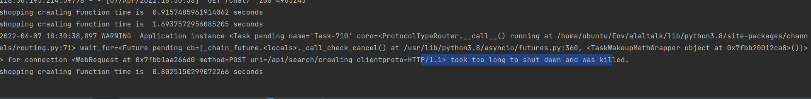

## 4월 7일

***

* Project - ALALTalk
  * search 앱 테스트 코드 작성
    * 좋아요 취소, 마이페이지 취소 찜취소 가능, 추천 버튼 유지 기능 (리팩토링 필요)

 
  
* error
  * 
  * `jango channels` 관련 문제 같은데 더 알아 봐야 겠다.

* 내일 목표 
  * 추천 컨텐츠 토글에 따라 추천 컨텐츠를 보일지 말지 정하기 
  * 책, 쇼핑에서 찜, 공유하기 항상 보이게 하기
  * 크롤링양 더 많이해서 페이지네이션 구현
  * css 수정 >> 크기 같은거 다시 맞추기! >> 반응형 구현! 
  
 

__마무리__
>  헬스 오늘 빡시게 해서그런지 너무 힘들다..머리가 안돌아감..아직 체력이 많이 
> 안 올라 온 것 같다. 
> 머리가 안돌아가..손도 안움직여..ㅠㅠ
> 힘이없어..푹자고 내일 다시! 내일은 헬스 쉬는날이니 아침부터 빡세게 달리기
> 정처기 공부도 다음에!
