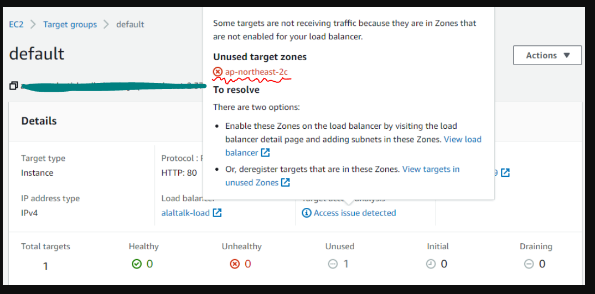
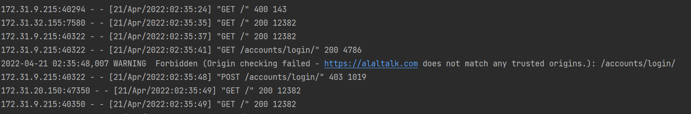

## 4월 20일

***

* 이전 프로젝트 리팩토링
  * 뉴스, 북 크롤링 → requests로 변경
  * https 연결 성공

* 프로젝트 회의
  * Temproject -> 프로젝트의 참가자를 펀딩받는 웹사이트 
  * 기획문서 및 와이어 프레임 작성중
  
* 헬스 상체 운동  
* 책읽기 - 헤드퍼스트 디자인 패턴

* Error 
  * ELB 오류 수정 
    
    * 해당 오류는 서브넷을 추가 하지 않아서 생기는 문제였다.
  * Django, https연결 시 CSRF Token 설정 
  
    * Django 4.xx 버전 부터는 setting.py 에 CSRF token origin을 작성해줘야한다.
    * `setting.py` - `CSRF_TRUSTED_ORIGINS = ['https://alaltalk.com']`
    *  [참고 자료](https://stackoverflow.com/questions/70285834/forbidden-403-csrf-verification-failed-request-aborted-reason-given-for-fail)

 
  

__마무리__
> 시간을 좀 더 내고 집중해 보자! 더 할 수 있다!!
> 알고리즘 한문제도 풀 수 있었는데 아쉽다. 