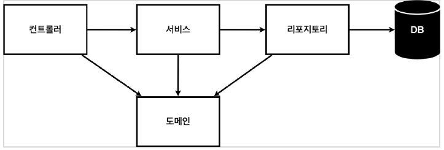

## 5월 13일

***

 

* __[알고리즘 문제](https://github.com/CureLatte/Bae_joonHub.git)__
  * [나누어 떨어지는 숫자 배열](/Algorithm/Programmers/Level1/나누어떨어지는숫자배열.py)
  * [전화번부 - Java](/Algorithm/Programmers/Level2/전화번호목록.java)
    * TC - ["934793", "34", "44", "9347"] -> False 
    * 질문사항을 통해 찾은 예외처리 : 길이를 기준으로 나누게되면 중간에 접두어가 바뀌는 것을 파악하지 못한다. 

 

* Spring 강의 
  * mvc 패턴을 따름
    * Controller - 웹서비스 컨트롤
      * @GetMapping -> GET Method를 위한 Annotation 
    * service - 비지니스 로직
      * 의존성 주입을 당함 -> Test 시 같은 Repositroy를 사용하기 위해 
    * repository - 저장소
    * domain - DB에 들어가야하는 데이터 객체
    * 위에서 부터 의존성을 가짐 (계층형 구조)
    
  * Test code 
    * test 폴더에서 작성
    * @Test anotation 추가 
    * @BeforeEach -> 각 테스트가 시작할 때마다 실행 되는 함수
      * Repository 생성
    * @AfterEach -> 각 테스트가 끝날 때마다 실행 되는 함수
      * Repository 삭제 : 각 테스트는 독립 되어야한다. 
    * 테스트 코드 이름은 함수로 작성해도 무관!
    
  * Bean 등록
    * 컴포넌트 스캔과 자동 의존 관계설정
      * @Autowired - @Service
      * @autowired - @Repository
      * @Componant
      
    * Java 코드로 직접 등록 
      * SpringConfigure 패키지
        * @Configuration 
        * @Bean
        
 

* CS 녹음자료 
  * 데이터베이스가 생겨난 이유 
  * 이전에는 파일시스템으로 파일형식으로 데이터를 관리하다보니 데이터 중복, 무결성문제가 대두됨
  * 이를 막고자 데이터베이스라고 하는 통합관리 데이터를 만들고 
  * 이를 사용하기위한 소프트웨어로 DBMS 라는게 생겨남 
  * DBMS 특징 5가지
    * 무결성 : 데이터 유효성검사를 통해 잘못된 데이터 출입 못함
    * 일관성 : 정해진 로직를 통해서만 받기 때문에 
    * 중복 최소화 : 통합되어 관리 되기 때문에 중복이 없음
    * 보안성 : 인가된 사용자만 데이터를 조작할 수 있도록 권한 제어가 가능
    * 독립성 : 성능 향상을 위해 파일크기를 늘려도 응용프로그램 설정을 하지 않아도 된다. 

__느낀점__
> Spring 강의는 Java문법이 어색하지만 Django Framework를 해봐서 그런지 구현을 할 수 있을 것같다. 
> 가장 기초적인 방법이겠지만 내일 수업 완강 후 이것 저것 만저보자! 
> 내일 모각코 자료 마무리로 만들고 알고리즘 큰수 푸는 걸 목표 
> 