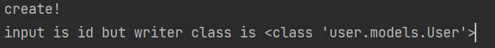

## 6월 19일

***

 

* ### DRF 과제 
  * `DateTime.Datetime.strftime('%Y-%m-%d %H:%M:%S')`
    * `Datatime class` 내용을 `String` 으로 바꾸는 함수 
    
         

  * `Serializer`
    * `custom validation` 
      * 기존의 validation를 수행후 추가적인 validation를 추가하는 것
    * `custom create`
      * 기존의 `create` 함수를 Overwrite 를 해서 완전 교체되는 함수 
      * 주의 : 하나의 필드를 `Serializer()`을 생성을 하게 되면 해당 필드는 `validated_data` 에서 제외 된다!
      * request 의 ForeignKey로 받을 데이터에 PK 값을 받으면 알아서 해당 Model을 가져온다. 
        * 
        * 
        * [자세히](https://jscript.tistory.com/38) 
        
         
        
    * `custom update`
      * 기존의 `update` 함수를 Overwrite 를 해서 완전히 교체됨
      * 주의 : `custom validation`이 실행 후 실행하므로 `validation`에서 없을 경우를 처리해야 함 

test 