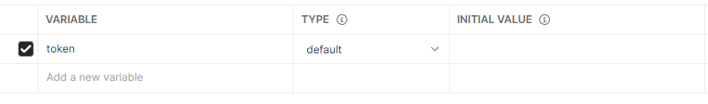

## 6월 23일


***

<br>

* ### 업무
  * POSTMAN 
    * 토큰 발급 후 해당 토큰을 계속해서 가지고 있는 법
      * Environments 생성 - 받고 싶은 변수명을 작성
      * value는 작성하지 않는다.
      * 
      * 발급 하는 API 에서 Tests를 작성한다.
        ```javascript
            //  JavaScript
            if(pm.response.code === 200){
                pm.environment.set('token', pm.response.json().token)
            }
        ```
      * 해석 :200 코드 일떄 포스트맨 환경 변수에 `'token'` 이라는 곳에 해당 API 의 결과중 token 에 해당하는 Value를 넣겠다.
      * 원하는 변수에 `{{token}}` 작성