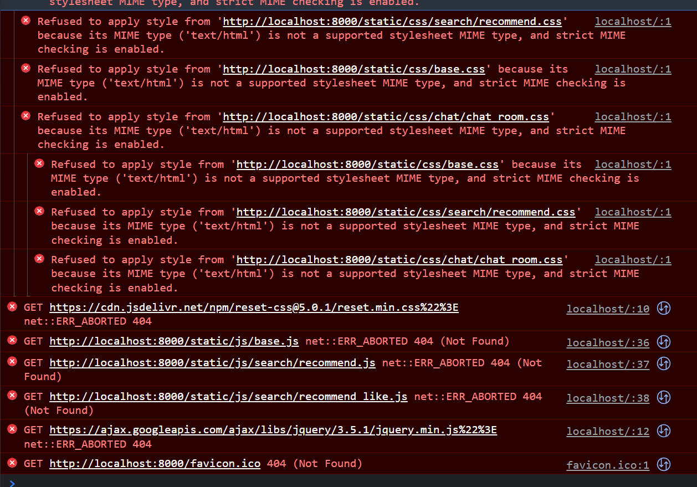
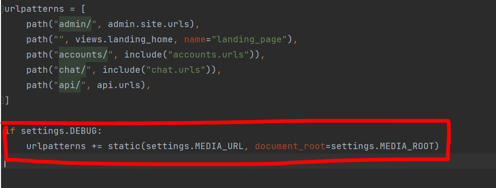

# TIL

***


## 사용 규칙

* 날짜 별로 매일 꾸준히 작성할 수 있도록 하기 
* 최대한 깔끔 하게 쓰도록 노력
* 상세한 내용 이나 정리를 했다면 링크 걸기
* 마지막 에 소감 또는 느낌점 
* 블로그 에 추가 링크 올리기
* 커밋을 자주 하지 말 것

***

<br>

[블로그 링크](https://jscript.tistory.com/)  

[오늘](#3월-29일)

* [2021년](#12월-23일)

  * [12월](#12월-23일)

* [2022년](#2022-년)

  * [1월](#1월)
  * [2월](#2월)
  * [3월](#3월)

<br>

***

### <u>12월 23일</u>

- Git ( 개념 및 pycham 연동)
- Markdown 기초 및 정리
- CSS - flex, vh,em
- [기초 Markdown 문법 정리](Markdown/기본_문법.md)

<br>  

>TIL 작성 첫 날이라 깔끔한 정리가 부족한 듯 싶다.  
>조금씩 더 다듬어 보도록 하고  
>정리도 시간 나는 대로 틈틈히 작성 하도록 하자

<br>

***

### <u>12월 24일</u>

* Merry christmasEve!~~~
* 인스타 그램 클론 코딩 공부 (진행중)
* div 태그 설정 및 고치기
  * [```<div>```정리](css/div.md)
* 개발자 도구 이용
* view-point 적용 

  * [```<meta>-viewpoint``` 설정](css/meta.md)
  
<br>

간단 소감 : 

> 인스타 클론 코딩을 진행 하고 있는데 CSS는 직접 하면서 
> 진행을 해야 많이 배우고 실제로 지정 해줘야 하는 요소 들이 많아서
> 많이 헷 갈린다.<br>
> 
> 특히 viewpoint설정을 제대로 안해서 해설을 들어도 시간을 많이 씀
> 
> 이때 팁으로 받은 게 헤더파일과 같이 적어주면 도움이 된다고한다.<br>
> 주말에는 pc버전으로 구현을 해야해서 추가 코딩을 해야될 듯싶다.
> 

<br>

***

### <u>12월 25일</u>

<br>

* div안에 img태그 넣고 정리하기 
* 인스타 클론코딩 (완)
  * profile 비율 맞추기 
  * height는 굳이 안쓴다. 
* ```div``` - ```background-image``` 사용 시 ```no-repeat```:배경 반복 취소
* ```max-width``` ```max-height``` ```vw``` ```vh``` ```%``` 
```px``` 사용
  
<br>

간단소감 : 

> 주말이라 지난 숙제를 마무리하기 위해서 추가 작업을 하였지만 
> 쉽게 끝나질 않았다. 특히 %와 vw, vh 단위가 많이 헷갈렸다.    
> 
> 하나 중요하게 
> 깨달은 것은 ```div``` 를 만들 떄는 height를 정하지 않고 진행한다. 
> 물론 핸드폰 기준으로 만들었기 때문이지만 가장 안쪽에 들어가는 크기에 맞춰서 
> 외곽이 정해진다. 
> 그러니 내용물을 맞춘후 설정하는 방법이어야한다. 

<br>

***

### <u>12월 27일</u>

<br>

* ```@media``` 미디어 쿼리
* scroll bar 안 보이게 하기 
* 인스타-PC 버전 클론 코딩 완성
* 알고리즘 문제 복습 및 작성 (라면 공장 문제까지)
* BFS Dictionary 만들기 (queue 이용)
  
<br>

간단소감 

> ```@media``` 쿼리를 처음 적용해보았는데 간단하게 ```css```넣는 방식으로 구현을 했지만  
> 나중에는 ```@media``` 파일만 따로 모아 ```<header>``` 파일에 ```<link>```
> 를 통해 연결 한다. 또한 각 미디어마다의 설정도 적용할 수 있다. 

<br>

***

### 12월 28일 

* 소스 트리 설치 및 다운
* 원격 저장소 개설 및 권한 
* branch 작업 및 merge 연습
* 프로필 메인 화면 HTML, css 작성
* 원격 저장소 오류 수정 및 재건설
* 내용 정리
* 

간단 소감
> 처음으로 협업프로젝트를 진행을 했다
> 그리고 또 처음 으로 팀장을 맞아서 진행을 했다..
> 기존에 조금씩 봤었던 협업 기술들을 미리 들어본 경험이 있어서그런지
> 오류가 많이 나오는 상황에서도 간신히 버틸 수 있었고 다행히 
> 오늘안에 저장소관련 오류를 다 잡아서 너무 좋았다. 
> 내일 부터는 팀원들의 진행속도를 잘 파악해서 앞으로 일정 산출을 
> 해보려고 한다. 


***

### 12월 29일 

* jwt
* jinja2 템플릿 언어
* 개인 서버 개설 하기
* DB 연결 및 테스트
* 프로필 관리 페이지 이동 만들기
* 게시글 관리 페이지 이동 만들기
* 헤더 파일 작성 및 디자인

간단 소감
> 팀원들이 열심히 해줘서 생각 보다 체계적으로 빨리 진행이 되는 것 같다
> 내일 서버 합치기 및 각 페이지 완성을 목적으로 진행 하면 금요일가지 뼈대 완성은
> 될 것같다. 이후 기능 구현을 더욱 추가해야겠다.


***
<br>


# 2022 년

***

<br>
<br>

***

## 1월


***

<br>


### 1월 5일


* Git에 대한 기초 개념
* 협업에 대한 내용 및 매너
* 

간단 소감
> 지난 1주일 동안 프로젝트를 하느라 TIL가 없데이트 되지 않았는데 
> 그간 기능 구현을 위해 검색 했던 자료들, 찾아봤던 메소드 들을 까먹어서 아쉽다. 
> 또한 목표 없이 오랜만에 강의만 들어서인지 많이 쳐지고 집중이 잘 안된다.
> Git에 대한 강의를 미리 들었다면 협업을 더 잘 했을 것 같다.
> 이번 기회에 제대로 알 수있어서 다음 프로젝트를 작업할 때는 더 쉽게 협업을 할 수 있을 것 같다. 

***

<br>


### 1월 6일


* 머신러닝 수강 2주차 완
* [Linear_Regression](Machine_Learning/Linear_Regression)
* [Logistic Regression](Machine_Learning/Logistic_regression)
* [SVM](Machine_Learning/SVM.md)
* [PreProcessing](Machine_Learning/Preprocessing)
* 

간단 소감
> 머신 러닝에 대해 2추자 수강을 완료했다. 머신러닝이라는게 생각보다 어려울 줄 알았는데 
> 이미 라이브러리가 있고 해당 라이브러리에 대입을 해서 사용하기 때문에 
> 새로운  python Library를 쓰는 듯한 느낌이다. 문법이나 다른 라이브러리에 대해 
> 암기가 필요할 것 같으나 이미 짜여진 코드를 사용 하기에는 무리가 없다고 생각 한다.


***

### 1월 10일


* 문자열 압축 알고리즘 코드 리뷰
* 팀프로젝트 세팅 및 회의
* 소스코드 정리, 브랜치 정리 완료
* GitFlow를 이용하여 정리할 예정
* XD 파레트 작성

간단 소감
> 이번 프로젝트에서는 다른팀들의 프로젝트를 참고하여 하지 않았던 협업툴들을 이용할 계획이다.
> Notion이나 대쉬보드도 만들어서 협업시 더 명확하게 할 수 있도록 해야겠다.
> 
> 

****

### 1월 20일


* Django 온라인 강의 끝
* baekjun 알고리즘 문제 ( 입출력/ if문 / for문)

간단 소감
> 
> 백준 알고리즘 문제를 풀었을 때 코드 중간의 내역을 확인 할 수없어서 해당 파이참에서 실행을 하고 복사 붙여넣기 하는 식으로
> 진행이 되어야한다. 


<br>
<br>
<br>
<br>

***
## 2월

***

<br>
<br>

### 2월 17일

***

<br>

* 특강 
  * GAN 
  * Context Style Transfer model
  * AI 교양

* Django 심화반 온라인 수업 마무리 (4주차~ 5주차)
  * E2E Test 
  * Swagger
  * API versioning
  * Transaction
  * Async
  * AWS RDS connecting
  * systemctl service 등록

* 생활 코딩 Java1 수업 듣기 (8 ~ 11강)
  * 변수 
  * Casting
  * Eclipse Debugger 사용

_간단 소감_
> TIL 쓰는 습관이 아직 덜 길러진 것 같다. 중간에 프로젝트를 해서 그런것 같다. 
> 내일은 S3 만들어 보고 RDS 까지 연결을 해봐야겠다. 시간이 남으면 모델 불러오는 것까지 해보자 
> WIL 작성 시간도 생각 해보자 
> 오늘 하루도 대견 하다! 


<br>
<br>

### 2월 21일

***

<br>

* 특강 
  * Context Style Transfer 이용
  * S3 연결
  * 배포 ( 실습 못함)

* Django를 이용한 개인 블로그 만들기
  * [개발 문서 작성](https://quartz-laborer-e78.notion.site/Blog-Project-5f91923f140342bb80face9ee21e3d1e)
  * [github 주소](https://github.com/CureLatte/my_blog_portpolio.git)
  * 오늘 부터 개발 시작
  * Django 복습!
  

__간단 소감__
> django 복습을 위해 개인 블로그 사이트를 만들고 있다.  
> 복습을 위해 시작했지만 기존에 사용하더 views파일에 모두 함수를 넣는 것이 아니고 
> 쉽게 작성할 수 있는 ClassVeiw() 를 사용하는 것이 아니라
> django-ninja를 이용하여 api 문서를 만드는 방식으로 제작을 했다. 
> 그래서 service(DB관련 작업/ 연산/ 계산을 하는 함수 모임) 과 router(Ajax/ Form/ Request를 통해 값을 받고 결과값을 내보내는 곳)으로 분할해서
> 작업을 해야한다.  
> (원래는 view 함수안에 다 때려 박음)
> 
> 그래서 그런지 설정해야할 것도 많고 무엇보다 TEST를 돌릴 수 있다는 것이 제일 좋은 점이지만 앞으로 만들어야할 폴더와 파일 들이 많고 각각 함수가 어떻게 돌아가는지 (인자와 결과값, render 등등 )
> 테스트할 필요가 있다. 
>


<br>
<br>

### 2월 22일

***

<br>

* Django Project 시작! 
  * 담당 : Frontend
  * Notion 작성 및 정리, 프로젝트 웹디자인 제작

* Django 개인 블로그 
  * Django-ninja를 이용한 서버 제작
  * Login page 제작
  

__간단 소감__
> Django-nina 사용이 BadRequest 가 떴다. Form 태그를 이용하여 router에서 request를 받는 건데 이상하게 
> request를 보내지 못한다. Django 에서는 무조건 Ajax처럼 반환값이 있어야하거나 form태그 이상이 있는 걸로 파악이 된다. 
> 
> docs를 통해 연결했을 때는 무지 잘되어서 Frontend 쪽 문제 인 듯 싶다. 
>
> 오늘로써 새로운 프로젝트를 진행하게 되었다. Javascript 구현 기능을 많이 하기 위해 프로트 엔드를 잡았고 
> 웹디자인 부터 진행했다. 이미 있는 미술관 웹사이트를 벤치마킹하여 제작을 했고 info부분에 재미있는 아이디어가 생각나서 
> 적용을 시켰다. 팀원들이 좋아 해서 다행이다. 
> 
> 머신러닝 관련 이론은 이해를 했지만 구현은 아직 안해보아서 늘 걱정이다. 복습겸 진행하는 개인 프로젝트에 적용을 
> 해보는 것도 나쁘지 않을 것 같다. 
> 


<br>
<br>

### 2월 23일

***

<br>

* Django Project 시작! 
  * 

* Django 개인 블로그 
  * Django-ninja를 이용한 서버 제작
  * Login page 제작
  

__간단 소감__
> Django-nina 사용이 BadRequest 가 떴다. Form 태그를 이용하여 router에서 request를 받는 건데 이상하게 
> request를 보내지 못한다. Django 에서는 무조건 Ajax처럼 반환값이 있어야하거나 form태그 이상이 있는 걸로 파악이 된다. 
> 
> docs를 통해 연결했을 때는 무지 잘되어서 Frontend 쪽 문제 인 듯 싶다. 
>
> 오늘로써 새로운 프로젝트를 진행하게 되었다. Javascript 구현 기능을 많이 하기 위해 프로트 엔드를 잡았고 
> 웹디자인 부터 진행했다. 이미 있는 미술관 웹사이트를 벤치마킹하여 제작을 했고 info부분에 재미있는 아이디어가 생각나서 
> 적용을 시켰다. 팀원들이 좋아 해서 다행이다. 
> 
> 머신러닝 관련 이론은 이해를 했지만 구현은 아직 안해보아서 늘 걱정이다. 복습겸 진행하는 개인 프로젝트에 적용을 
> 해보는 것도 나쁘지 않을 것 같다. 
> 


<br>
<br>

### 2월 24일

***

<br>

* Django Project 시작! 
  * 웹 디자인 마무리 
  * 그리드에 맞춰서 처음 진행 (12Colum, 한 컬럼당 160px로 계산)
  * 머신 러닝 웹 서버 버그 해결 
  
    <br>
  
    < 인공지능 서버 관련 >
    
    김준태 튜텨님 특강 모델 : TensorFlow 이용 ( TensorFLow hub를 통해 모델 다운 ) 
    
    스파르타 코딩 모델 : PyTorch 이용 ( 확장자가 . T7 )
    
    이 두 가지를 섞으려고 노력을 했지만 각각 사용하는 라이브러리가 달라서 해결이 되질 않았다. 
    
    <br>
    
    < 전제조건 > 
    
    머신 러닝에 이미지를 계산하기 위해 `NumpyArray`를 INPUT으로 받는다.
    
    사용 프레임 워크 : `TensorFlow`, `PyTorch`  
  
    <br>
    
    < 예상 >
    
    `PIL` 과 `TensorFlow.Array` 으로 변환한 `NumpyArray`를 PyTorch모델이 넣을 수 있느냐? 
    
    이미지 > `PIL` > `TensorFlow.Array` > `NumpyArray`  > `PyTorch` 모델 사용 가능 ?? → 에러 발생
    
    <br>
    
    < 해결 > 
    
    각 라이브러리마다 변환되는 순서와 INPUT 값이 다르다 
    
    `TensorFLow` : `PIL` 라이브러리를 이용  
    
     이미지 > `PIL` > `TensorFlow.Array` > 전 처리( / 255) > `NumpyArray` > `TensorFlow`모델 > 후처리 ( * 255 ) > 이미지 
    
    `Pytorch` : `OpenCV` 라이브러리를 이용  
    
    이미지 > `OpenCV.imread()` > `NumpyArray` > `PyTorch`모델 > 이미지 
    
    중간에 `NumpyArray`로 만드는 과정은 맞지만 `PyTorch`를 사용할 때 는 
    
    전처리( / 255 ) 를 안하기 때문에 하지 않고 바로 `PyTorch`모델에 넣은 후 후처리도 생략한다.  
    
    ( `PyTorch`는 계산 과정중 ‘RGB’ 가 “BGR” 로 바뀌기 때문에 변환 시 꼭 고려하기! )


* Programers Level1 신고 결과 받기 알고 리즘 해결
  
__간단 소감__
> TensorFlow 모델, PyTorch 모델에 따라 결국에는 NumpyArray를 사용한다는 것,  
> 모델 별로 자주쓰는 라이브러리가 존재한다 것,  
> 이미지를 불러오는 라이브러리 PIL, OpenCV는 서로 다르며 각각의 형식이 다르는 점 등  
> 이미지 처리 관련 함수를 더 깊이 이해하는 날이 었던 것 같다.
> 내일 목표는 HTML 제작을 빨리하여 Front를 완료하는 것이다. 

***
<br>
<br>
<br>
<br>
<br>


## 3월


***

<br>
<br>
<br>


### 3월 29일

***

* ALALTalk
  * BackEnd
    * 찜 기능 / 찜 취소 기능 - Youtube, Book, News 완료 (DB 저장 및 중복 작업)
    
  * FrontEnd
    * 찜 기능 / 찜 취소 기능 Ajax 연결 및 구현 
    * 머신 러닝 서버 연결 


* Error
  > JVM library 관련 Error 
  > 
  > 머신러닝 서버에서 형태소 분석기인 `kormran` 을 사용하는데 해당 라이브러리는  
    `java`를 이용하여 만든 `python` 코드이다. 따라서 `java`를 기반으로 만들었으므로  
    `JAVA Development Kit` 이하 `JDK`를 깔아줘야한다.  
  > 추가로 `jypipe` 도 같이 깔아줘야 한다. 
  
  > * 에러 메세지
  >  
  > 
  >  해당 에러는 `HTML`에서 `<link>` 태그, `<script>` 태그 에서 지정한 파일들의  
  >  경로를 찾지 못할때 발생하는 에러이다.   
  > *  상황  
  > `Django` 에서 `AWS S3`를 통해 `static` 폴더를 전부 옮겨 놓은 후 연결까지 확인을 했지만
  >  실제 작업을 할 때는 바로 바로 적용이 되질 않는다고 하여 파일 등록한 부분만 주석처리하면 정상작동이 되는 줄 알았음
     
  > 
  > * 해결  
  > `setting.py`  에서 `DEBUG = False` 부분을 `DEBUG = True` 로 변경해 주었더니 정상 작동 했다.  
  >  이유는 `urls.py` 에서 빨간색 박스 친부분 때문으로 추측이 되는데  `DEBUG` 가 `False` 인 상황에서 작동 하는 코드 이기 때문이다.      
  >   
  >  
  > 
  > 
  
  >따라서 `DEBUG=True` 로 헀더니 정상 작동했다.

<br>    

* 책읽기 
  * CleanCode ~49page

* 

  
__간단 소감__
>  Youtube나 지난번에 들었던 특강에서 들은 바로는 회사는 깊이 있는 개발자,   
>   꾸준하게 성장하고 있는 개발자을 뽑고 싶어하고 이러한 어필을 잘 해놓거나    
> 증거물을 잘 남겨 놓은 것이 좋은 포트폴리오라고 들었다.   
> 비록 그동안 프로젝트 때문이라고 핑계를 대며 작성하지 않았지만 다시 한번 꾸준하게 작성하고자 다시 시작했다.   
> 나는 내가 많이 귀찮아하는 걸 알고 어느순 간 또 공백이 생길테지만 다시 시작하는 건 잘할 자신이 있으니 걱정 말고 다시 시작해보자  
>  

***
<br>